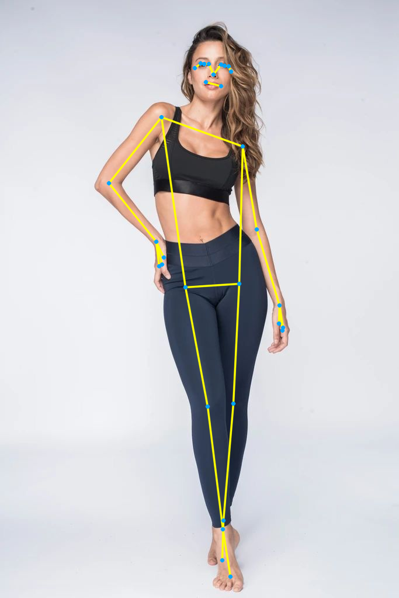
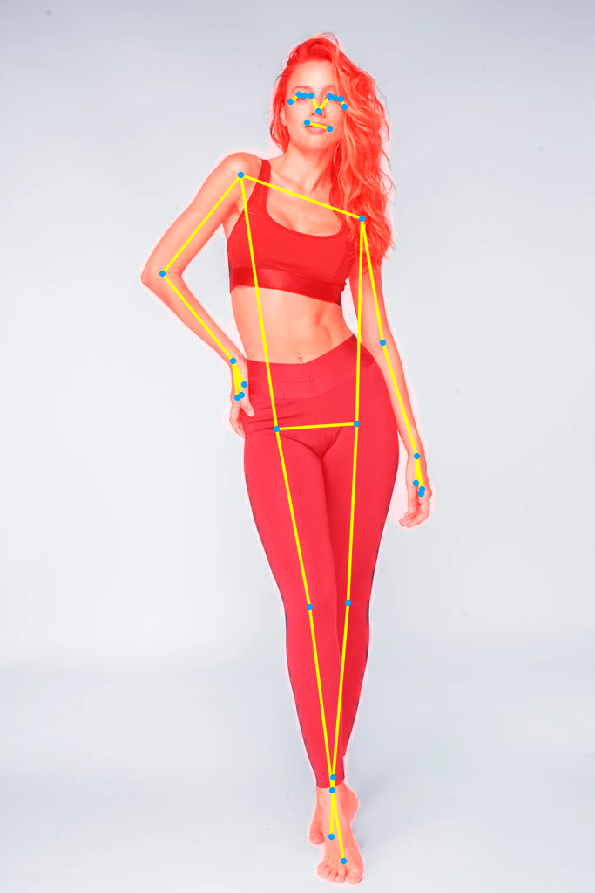
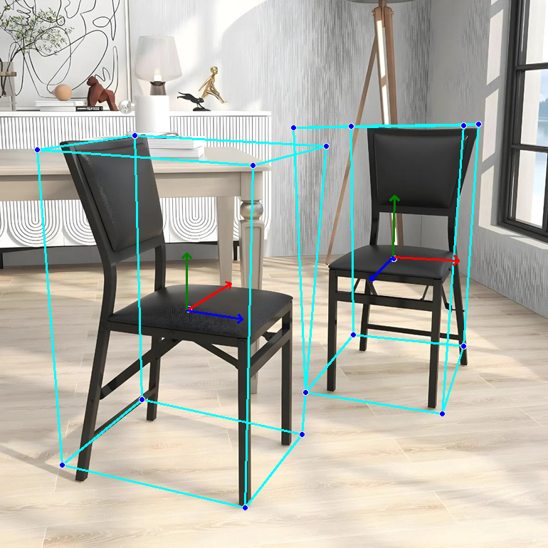
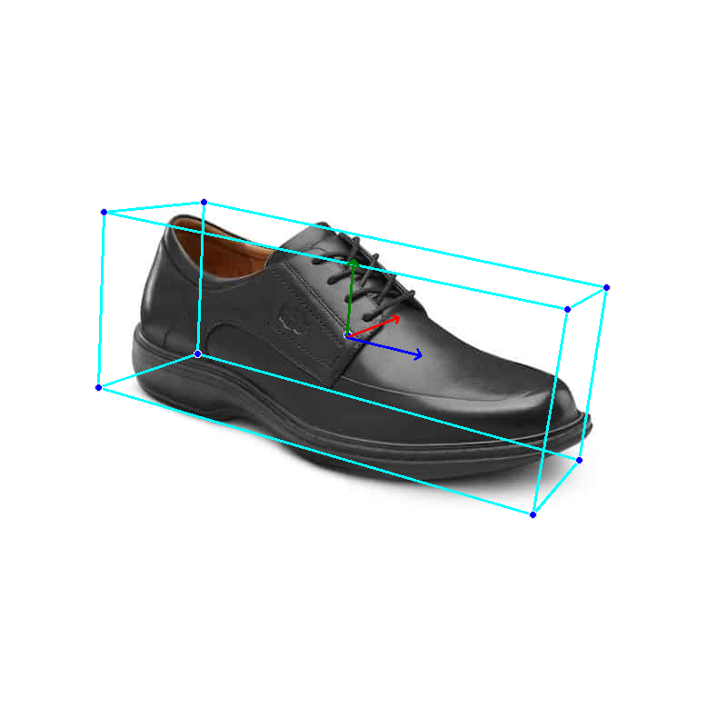
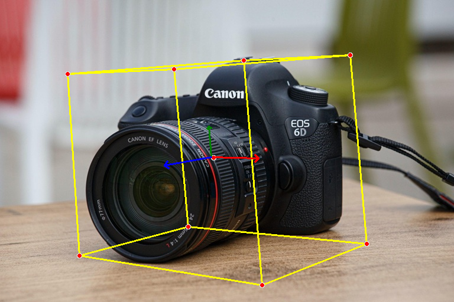
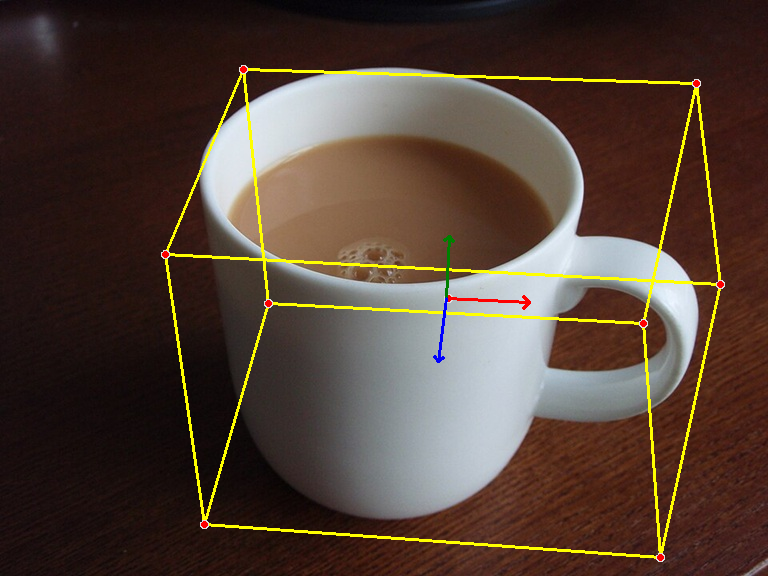

    <h1>Pose Estimation and 3D Object Detection using MediaPipe</h1>

 

 
 

---

## 🏗️ Methodology

- ⚛︎ Pose Estimation Model: **mp.solutions.pose.Pose**
- ⚛︎ 3D Object Detection Model: **mp.solutions.objectron.Objectron**
- ⚛︎ Framework: **MediaPipe**

---

## ⭐ Acknowledgements

- MediaPipe

---
